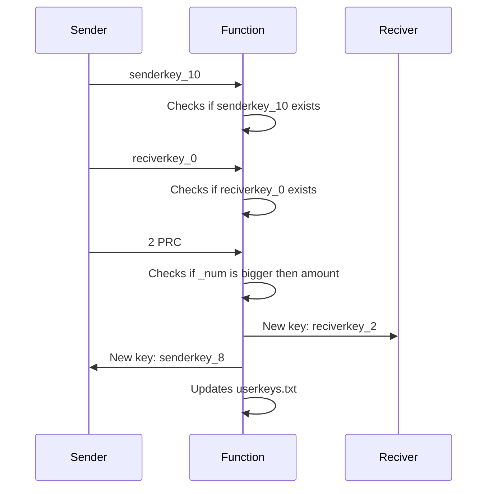

# Privacy Coin

  

As said in the name, privacy coin is based on privacy, all of the transactions are made will be encrypted and untraceable. This coin uses a unique system of user keys that identify the user. Privacy coin uses a primitive but secure way of storing your account balance, it latches the balance on the end of the user key, however a key can not be changed physically so no "fake" PRC will be on the chain;

This project is only in BETA version, if you have any suggestions, you are free to make a pull request or just leave a comment, and don't be afraid to snoop around the code :)