# MOOK Coin

MOOK is a cutting-edge cryptocurrency that utilizes its own unique mining algorithm called Proof of Validity (PoV). PoV is similar to proof of work, but is designed to be more efficient and environmentally friendly.

Unlike other cryptocurrencies that use proof of work, which can be incredibly energy-intensive and require massive amounts of computing power, PoV is designed to be much more efficient. This is achieved through a combination of innovative techniques, such as the use of specialized hardware and smart algorithms, that allow MOOK miners to achieve the same level of security and reliability as other cryptocurrencies, but with much less energy and computing power required.

One of the key benefits of MOOK is that it is much more environmentally friendly than other cryptocurrencies. Because PoV is designed to be so efficient, it requires significantly less energy and computing power to mine MOOK than it does to mine other cryptocurrencies. This means that MOOK is able to operate more sustainably and with a lower carbon footprint than other cryptocurrencies.

```mermaid
sequenceDiagram
    Sender->>Function: senderkey_10
    Function->>Function: Checks if senderkey_10 exists
    Sender->>Function: reciverkey_0
    Function->>Function: Checks if reciverkey_0 exists
    Sender->>Function: 2 PRC
    Function->>Function: Checks if _num is bigger then amount
    Function->>Reciver: New key: reciverkey_2
    Function->>Sender: New key: senderkey_8
    Function->>Function: Updates userkeys.txt
```

This project is only in BETA version, if you have any suggestions, you are free to make a pull request or just leave a comment, and don't be afraid to snoop around the code :)
